# Documentation
This is the documentation related to [Buttermanager](https://github.com/egara/buttermanager) GUI tool for easily management of BTRFS snapshots and system upgrades.

## BTRFS filesystem initial layout
For the purpose of this documentation, we are going to suppose that we have installed [Manjaro]() using a manual partitioning with this requirements:

- Only one disk: **sda**
- Only one partition in the disk: **sda1**
- *sda1* has been formatted using **btrfs**
- The mount point selected for this partition is **/**

After the installation of the operating system, the subvolumes automatically created are two (**@** and **@home**) as you can see in the screenshot below:

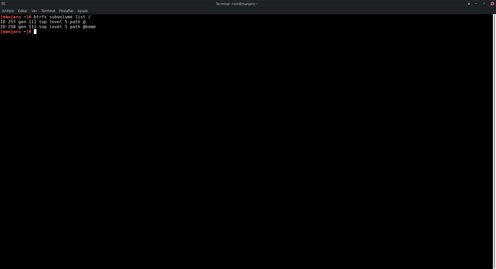

So the layout is something like this

```
Main Volume (ID 5)
|
|--- @ (Subvolume ID 257)
|
|--- @home (Subvolume ID 258)
```

**Important Note: If you are installing Arch from scratch or want to reshape your default BTRFS layout, you can check out this tips [https://github.com/egara/arch-btrfs-installation](https://github.com/egara/arch-btrfs-installation).**

## Mounting main volume (ID 5)
In order to manage in a proper way all the snapshots created and make things easier if you want to rollback your system to a previous snapshot, we are going to mount the main BTRFS volume in **/mnt/defvol** directory. For this, you first has to create this directory.

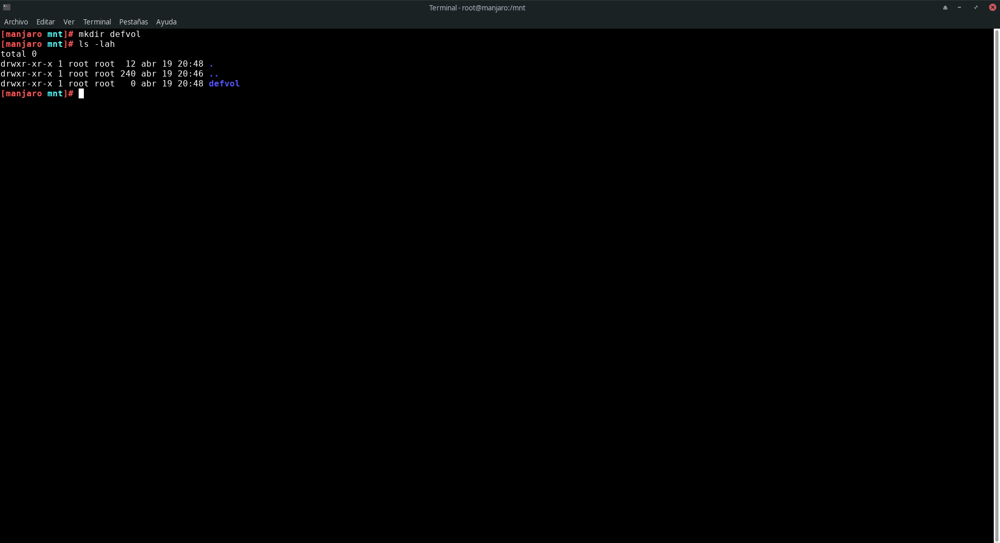

Include this new mounting point in **/etc/fstab** just to automount it when the system boots. Please, change the UID to the appropriate one or use labels if it is your case.

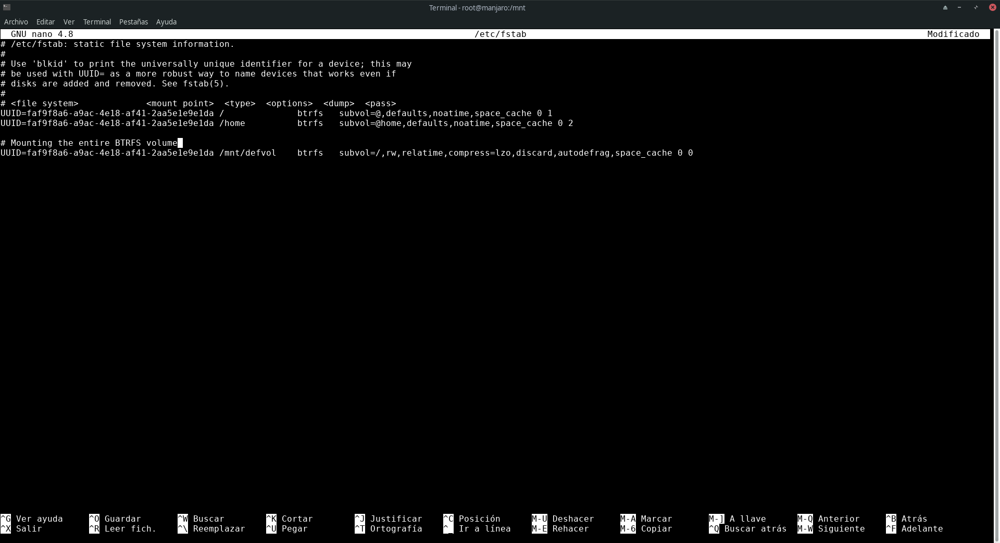

Once **fstab** is changed you can type
    
    sudo mount -a

and go to **/mnt/defvol**. You should see something like this:

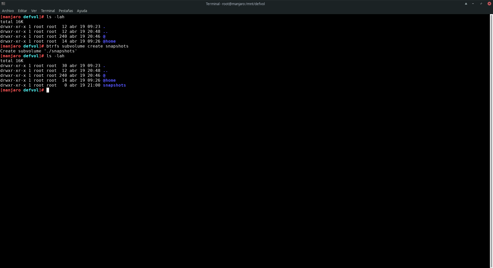

Create a new subvolume called **snapshots** at top level (as you can see above) using the command:

    sudo btrfs subvolume create snapshots
    
The final layout will be:

```
Main Volume (ID 5)
|
|--- @ (Subvolume ID 257)
|
|--- @home (Subvolume ID 258)
|
|--- snapshots (Subvolume ID 271)
```

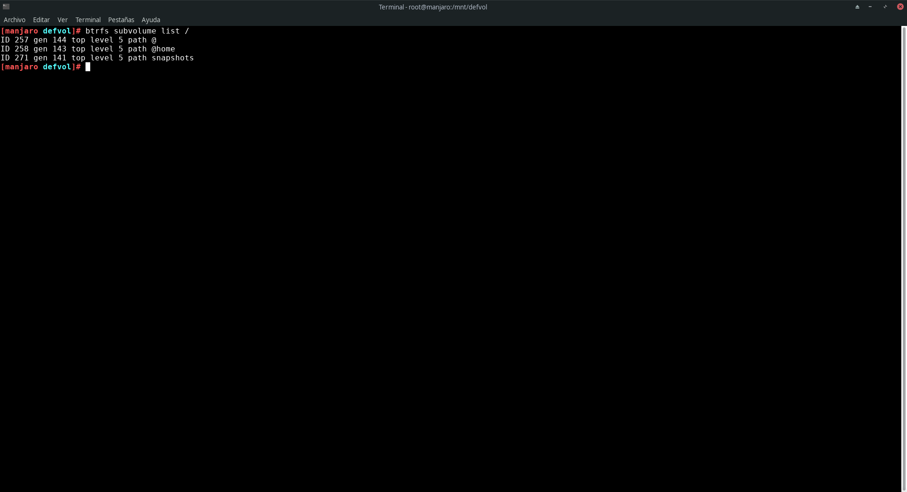

## Setting up Buttermanager
Yes, finally we are going to configure **Buttermanager**!. The first time you open the application, you will be warned because no subvolumes to create snapshots has been defined yet. You could use the application, but if you upgrade your system, **Buttermanager** won't create any snapshot.

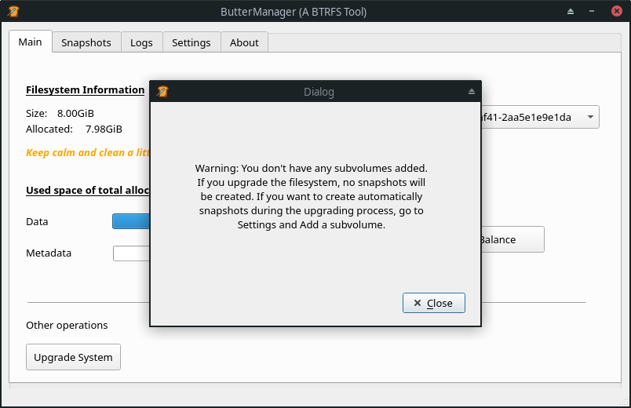

Go to **Settings** tab and click on **Add subvolume** button.

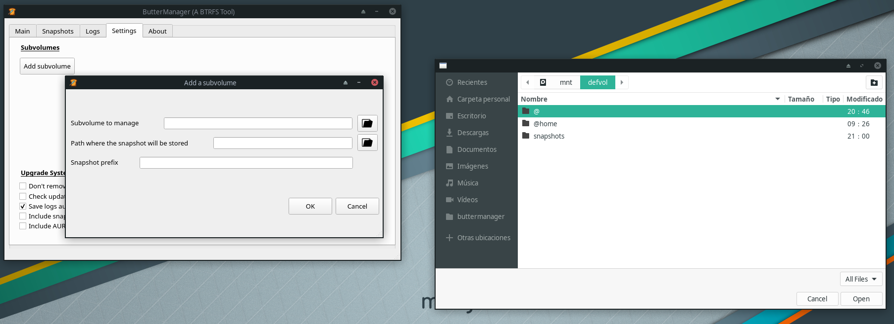

Now, using the layout defined in this example, we are going to configure two subvolumes to create snapshots of **root** and **home**.

### Subvolume 1 (root)
If you want **Buttermanager** creates a snapshot of your **root** partition everytime it upgrades the system, then you should fill the **Add a subvolume** window like this:

- *Subvolume to manage*: **/mnt/defvol/@**
- *Path where the snapshot will be stored*: **/mnt/defvol/snapshots**
- *Snapshot prefix*: **root**

>Please, use always different prefixes for different subvolumes (prefixes shouldn't even include words contained in other prefixes, i.e. in this example, you should never include root word in other prefixes).

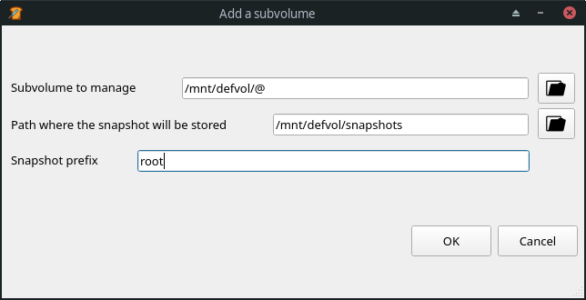

This way, everytime **Buttermanager** upgrades the system, it will automatically create a snapshot of the **root** mounted subvolume called **root-[date]-[number]** within **/mnt/defvol/snapshots/** directory. This snapshot will be **read only** by default.

### Subvolume 2 (/home)
If you want **Buttermanager** creates a snapshot of your **home** partition everytime it upgrades the system, then you should fill the **Add a subvolume** window like this:

- *Subvolume to manage*: **/mnt/defvol/@home**
- *Path where the snapshot will be stored*: **/mnt/defvol/snapshots**
- *Snapshot prefix*: **home**

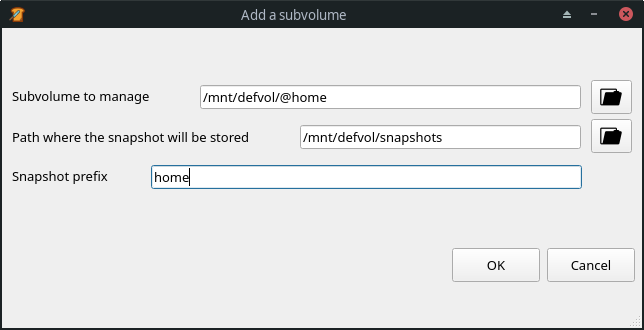

This way, everytime **Buttermanager** upgrades the system, it will automatically create a snapshot of the **home** mounted subvolume called **home-[date]-[number]** within **/mnt/defvol/snapshots/** directory. This snapshot will be **read only** by default.

## Integrating Buttermanager with GRUB
Since version **1.9**, Buttermanager can be integrated with GRUB using the awesome package **grub-btrfs**. If you have installed Buttermanager via your package manager, this depency is installed automatically, if don't, please install it manually. When the integration is enabled, all the root snapshots created since then, will be bootable directly from the GRUB menu.

To enable this feature, go to **Settings** and check **Boot the system from GRUB using snapshots**.

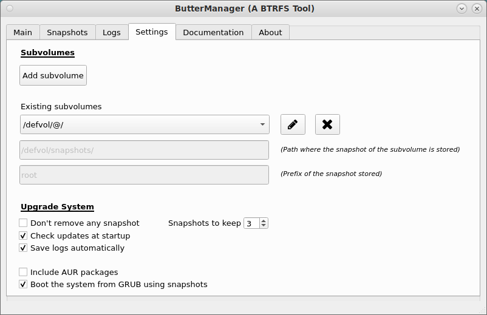

When this option is checked, **all the snapshots created will have read and write permissions** and the **/etc/fstab** file within the snapshot created will be modified in order to let GRUB to boot from it.

### Consolidating the snapshot booted
Buttermanager cannot properly work from a snapshot selected from the GRUB menu. Because of this, when you run Buttermanager again in this situation, you will see a message like this.

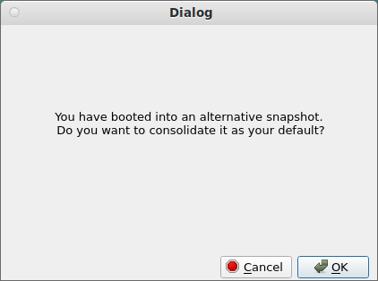

If you want to consolidate the current state of your filesystem (the snapshot in which you have booted) reverting all the changes done since then, then click button **Ok**.

If you don't want to consolidate this snapshot and you want to boot your system using the default root, then restart your computer and don't select any snapshot.

>After consolidating the current snapshot and rebooting the system, run Buttermanager again and click on button **Regenerate GRUB** in order to rebuild GRUB menu with all the snapshots present in the filesystem.

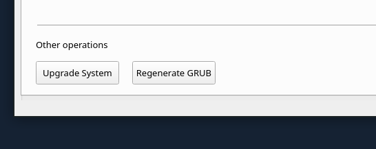

### Common problems
The integration of Buttermanager with GRUB can only be done if there is not any subvolume defined inside the root file system. As an example, take the case of the automatic installation using BTRFS in some distros.

By default, some distros (or more precisely systemd) create this BTRFS layout when the system is installed for the first time:

```
Main Volume (ID 5)
|
|--- @
|      |
|      |--- @/var/lib/portables
|      |--- @/var/lib/machines
|
|--- @home
```

You can see this layout in EndevourOS (MATE online installation) for example:

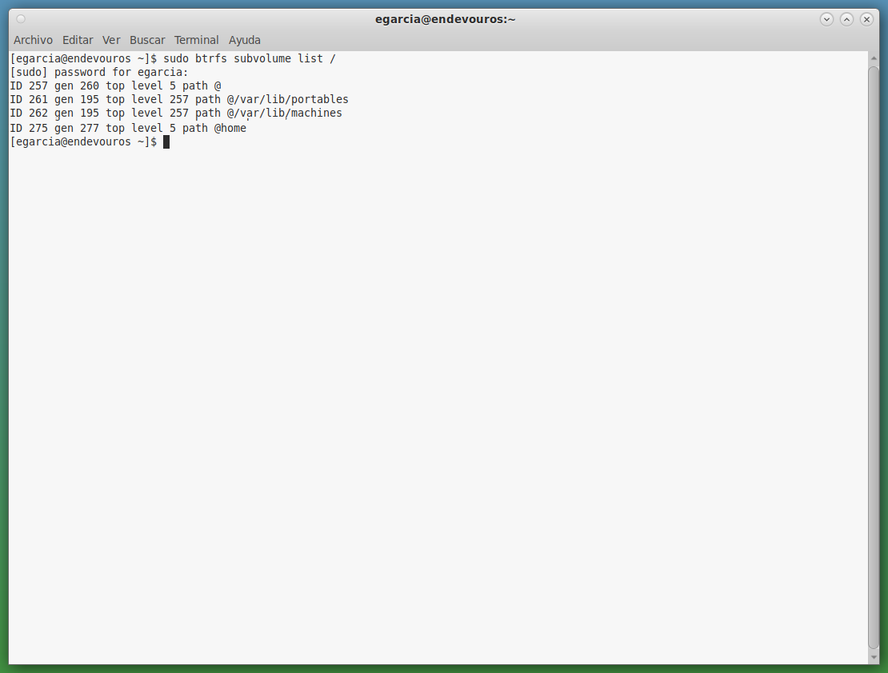

In this case, if you boot the system using an alternate snapshot, run Buttermanager and try to consolidate this snapshot as the default, you will receive this message:

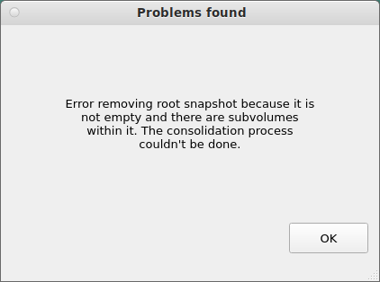

If you want to fix this problem, first execute these two commands in a terminal (please, adjust this command to your needs. In this case, main volume with ID 5 is mounted on /defvol):

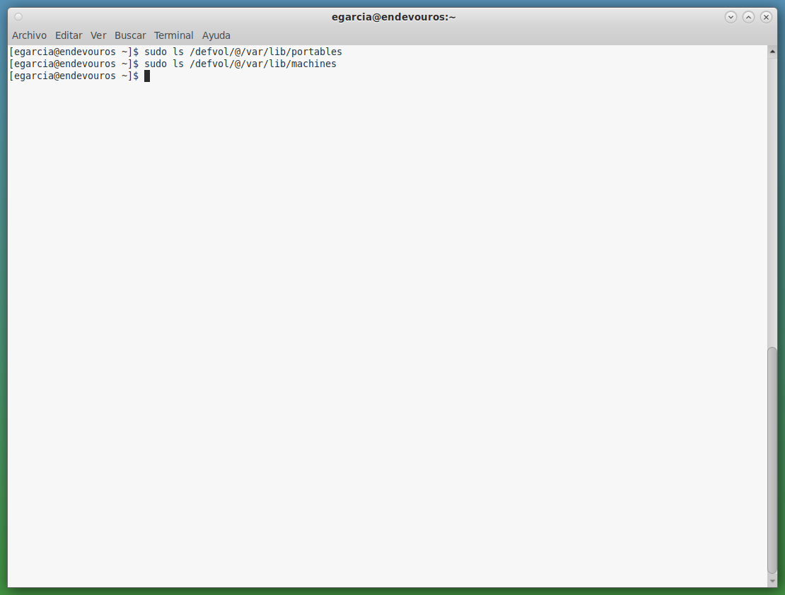

Those subvolumes (**@/var/lib/portables** and **@/var/lib/machines**) will be probably empty as you can see in the picture above. If this is the case, you can remove them without any problem. To do this, take a look at the commands you have to type in the picture below please, adjust this commands to your needs. In this case, main volume with ID 5 is mounted on /defvol):

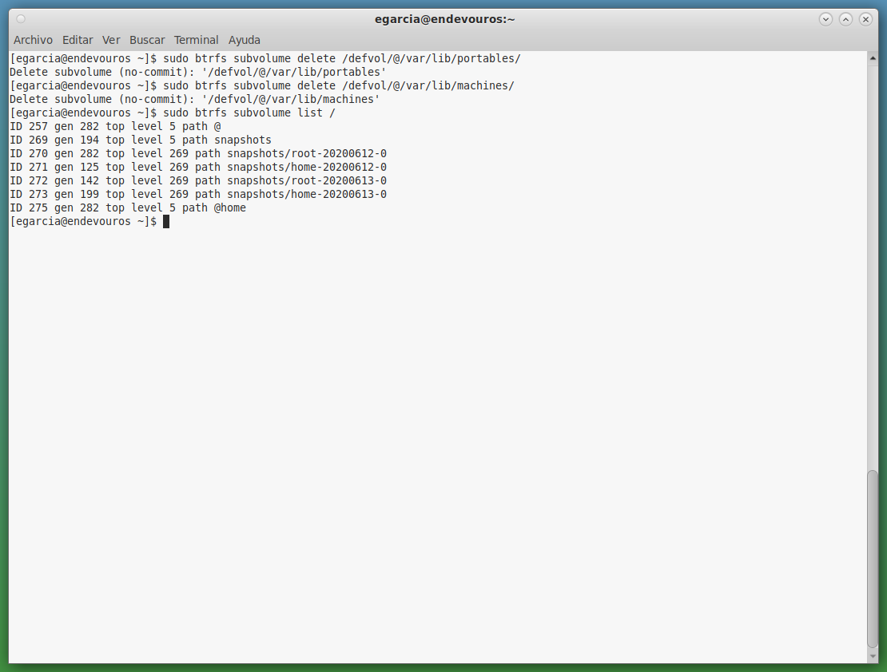


